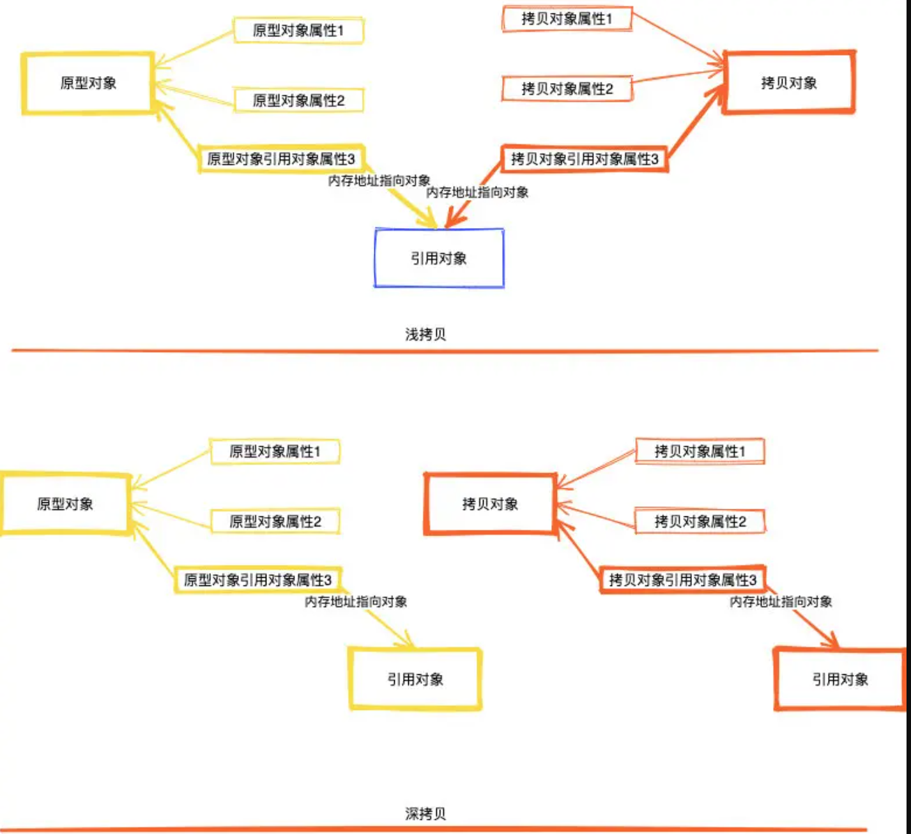

# 原型模式

原型模式其实就是一种克隆对象的方法。

如果对象的创建成本比较高，而同一个类的不同对象之间差别不大（大部分字段都相同），在这种情况下，我们可以利用已有对象（原型）进行复制（或者叫拷贝）的方式来创建新对象，以达到节省创建时间的目的。

这种基于原型来创建对象的方式就叫做原型设计模式（Prototype Design Pattern），简称原型模式。

## 何为 "对象的创建成本比较大"？

实际上，创建对象包含的申请内存、给成员变量赋值这一过程，本身并不会花费太多时间。

但是，如果对象中的数据需要经过复杂的计算才能得到（比如排序、计算哈希值），或者需要从RPC、网络、数据库、文件系统等非常慢速的IO中读取，这种情况下，我们就可以用原型模式，从其他已有对象中直接拷贝得到，而不用每次在创建对象的时候，都重复执行这些耗时的操作。

## 原型模式的实现方式：深拷贝和浅拷贝

- 浅拷贝：当拷贝对象只包含简单的数据类型比如int、float 或者不可变的对象（字符串）时，就直接将这些字段复制到新的对象中。而引用的对象并没有复制而是将引用对象的地址复制一份给克隆对象。
- 深拷贝：不管拷贝对象里面简单数据类型还是引用对象类型都是会完全的复制一份到新的对象中。

举个例子这就好比两兄弟大家买衣服可以一人一套，然后房子大家住在一套房子里（浅拷贝），当两个人成家立业了，房子分开了一人一套互不影响（深拷贝）。

### 深拷贝的实现方式

2种方法：
1. 递归拷贝对象，对象的引用对象以及引用对象的引用对象……直到要拷贝的对象只包含基本数据类型数据，没有引用对象为止。
2. 先将对象序列化，然后再反序列化成新的对象。
