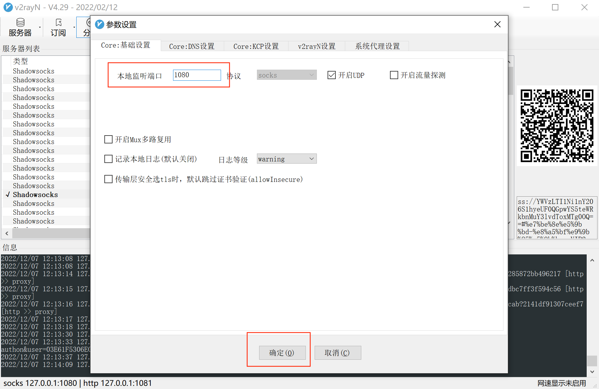
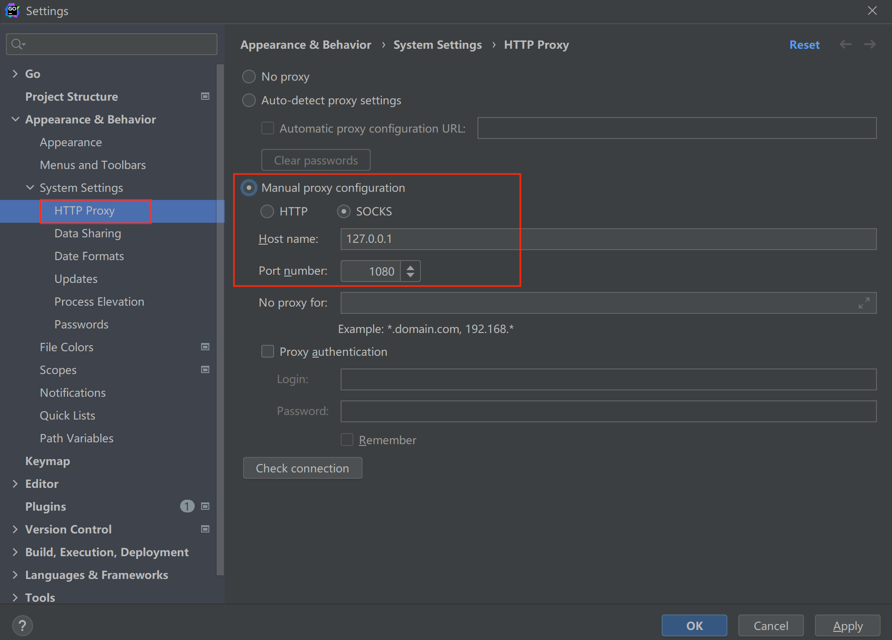
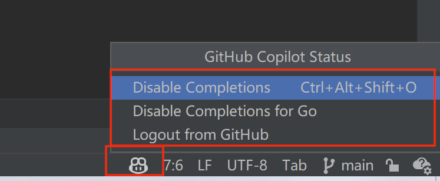
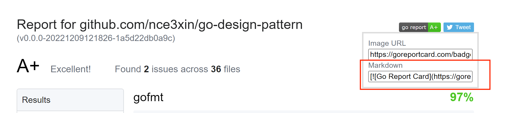

# Go设计模式

[](https://goreportcard.com/report/github.com/nce3xin/go-design-pattern)


Go设计模式实现。

## 目录

### 创建型
- [简单工厂模式](https://github.com/nce3xin/go-design-pattern/tree/main/00_simple_factory)
- [工厂方法模式](https://github.com/nce3xin/go-design-pattern/tree/main/01_factory_method)
- [单例模式](https://github.com/nce3xin/go-design-pattern/tree/main/02_singleton)
- [建造者模式](https://github.com/nce3xin/go-design-pattern/tree/main/03_builder)
- [原型模式](https://github.com/nce3xin/go-design-pattern/tree/main/04_prototype)

创建型模式主要解决对象的创建问题，封装复杂的创建过程，解耦对象的创建代码和使用代码。

其中，单例模式用来创建全局唯一的对象。工厂模式用来创建不同但是相关类型的对象（继承同一父类或者接口的一组子类）。由给定的参数来决定创建哪种类型的对象。建造者模式是用来创建复杂对象，可以通过设置不同的可选参数，“定制化” 创建不同的对象。原型模式针对创建成本比较大的对象，利用对已有对象进行复制的方式进行创建，以达到节省创建时间的目的。

### 结构型

- [代理模式](https://github.com/nce3xin/go-design-pattern/tree/main/05_proxy)
- [桥接模式](https://github.com/nce3xin/go-design-pattern/tree/main/06_bridge)
- [装饰器模式](https://github.com/nce3xin/go-design-pattern/tree/main/07_decorator)
- [适配器模式](https://github.com/nce3xin/go-design-pattern/tree/main/08_adapter)
- [门面模式](https://github.com/nce3xin/go-design-pattern/tree/main/09_facade)
- [组合模式](https://github.com/nce3xin/go-design-pattern/tree/main/11_composite)
- [享元模式](https://github.com/nce3xin/go-design-pattern/tree/main/10_flyweight)

### 行为型

- [观察者模式](https://github.com/nce3xin/go-design-pattern/tree/main/12_observer)
- [模板模式](https://github.com/nce3xin/go-design-pattern/tree/main/13_template)
- [策略模式](https://github.com/nce3xin/go-design-pattern/tree/main/14_strategy)
- [职责链模式](https://github.com/nce3xin/go-design-pattern/tree/main/15_chain)
- [状态模式](https://github.com/nce3xin/go-design-pattern/tree/main/16_state)
- [迭代器模式](https://github.com/nce3xin/go-design-pattern/tree/main/17_iterator)
- [访问者模式](https://github.com/nce3xin/go-design-pattern/tree/main/18_visitor)
- [备忘录模式](https://github.com/nce3xin/go-design-pattern/tree/main/19_memo)
- [命令模式](https://github.com/nce3xin/go-design-pattern/tree/main/20_command)
- [解释器模式](https://github.com/nce3xin/go-design-pattern/tree/main/21_interpreter)
- [中介模式](https://github.com/nce3xin/go-design-pattern/tree/main/22_mediator)

## 闲言碎语

### Goland环境变量配置

```
GOPROXY=https://mirrors.aliyun.com/goproxy/,direct;GO111MODULE=on
```

### go.mod生成方法

```
go mod init <name>
```

### Git配置代理

- 配置代理

  **配置socks代理：**

  ```shell
  git config --global http.proxy 'socks5://127.0.0.1:1080'
  git config --global https.proxy 'socks5://127.0.0.1:1080'
  ```

  端口1080要根据自己的v2ray配置来设置:

  

  **配置http代理**：

  不知道本地`http`端口是在哪设置的，应该是和`socks`端口号有关。 把v2rayN设为全局模式，打开win10的设置中代理，可以看到`socks`端口号，我这里是1081。

  ```
  git config --global http.proxy http://127.0.0.1:1081
  git config --global https.proxy https://127.0.0.1:1081
  ```

  socks和http代理二选一配置就行，有时候一个不管用，就切换另一个试试。

- 取消配置代理

  ```shell
  git config --global --unset http.proxy
  git config --global --unset https.proxy
  ```

- 查看代理配置

  ```shell
  git config -l
  ```

### Goland配置http proxy



### Copilot 尝鲜

开通了60天的试用，paypal支付。2个月后记得取消啊~

[新手指南](https://docs.github.com/en/copilot/getting-started-with-github-copilot/getting-started-with-github-copilot-in-a-jetbrains-ide)

#### 开启/关闭 Copilot



### go report card badge生成方法

点击 [go report card](https://goreportcard.com/) 进入网站，输入github项目地址，点击`Generate`按钮，即可生成report以及badge。

把生成的badge地址复制到github项目的`README.md`文件中，即可在github项目中显示report。

